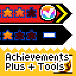

# Achievements Plus - Tools

A tool for selecting an area at the level, getting coordinates and the full code to use in your script.

The Achievements Plus itself is required below for correct working.

# How does it work?

Enable *Achievements Plus - Tools* above *Achievements Plus*. Then enter any level for which you want to get the coordinates of the area.

The HUD here has been replaced with information that will help track the positions of the character, the position of the first and second points of the selected area.

## 1. Preparation

Before you start, find a place on the level for which you want to selection an area, and switch to Debug mode to use Minecraft fly cheat.

## 2. The first point

Now that you have decided on the place and switched to Debug mode. Move to the starting point of your area and press the Y button on your device.

Make sure that the coordinates are displayed in the `First point` in your HUD.

> The starting point determines the position from which you will move to mark the second point.

## 3. Second point

When you have marked the first one, move to the second point and press the Y button. Also make sure that the coordinates are displayed in the `Second point` in your HUD.

## 4. Done!

After you marked the second point, the selection of the area was completed, and you received the collected code from the bottom of the screen, which you can use to check the match of the position of the coordinates of the player and your arena on the level.

To reset this area, press Y button one more time.

I hope this tool will help you to make it a little easier to create achievements related to visiting some places at the level.